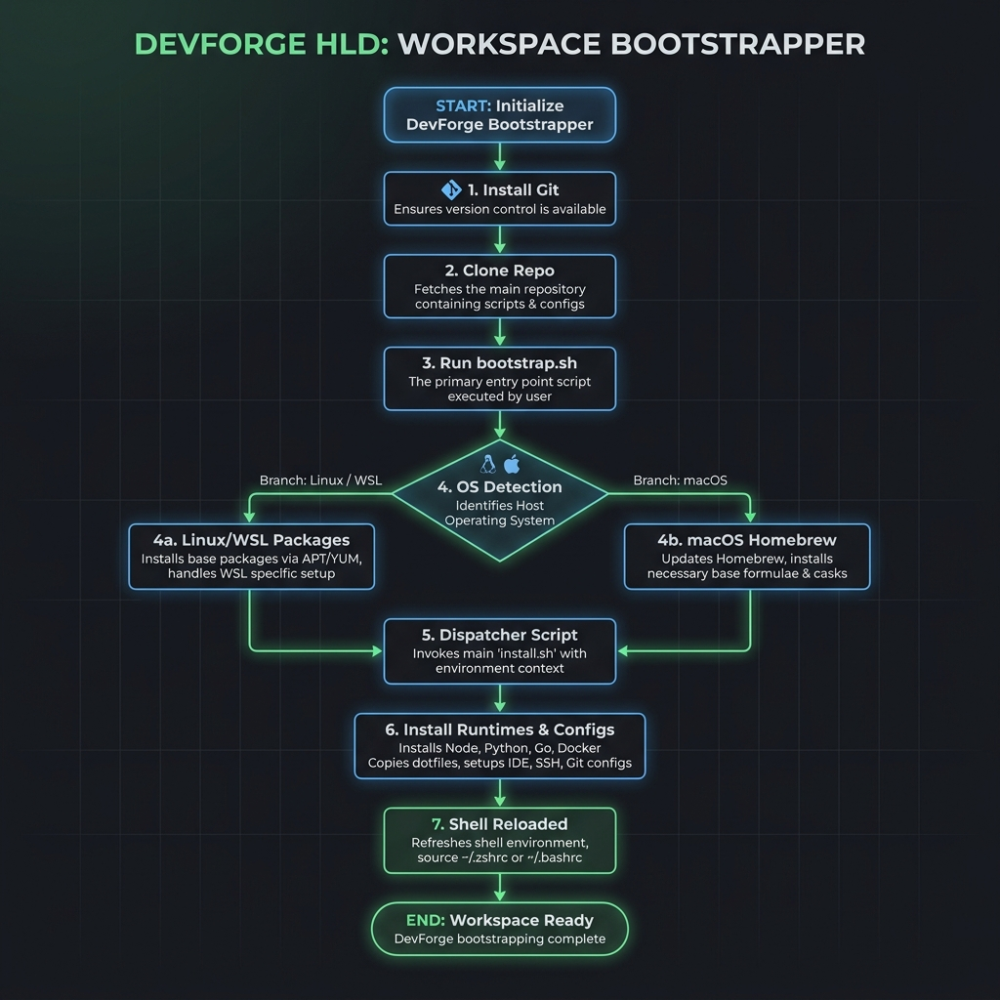

# DevForge

> **Developer environment automation.** A cross-platform, idempotent workstation bootstrapper that provisions a complete developer environment in a single command — no manual steps, no configuration drift.

Target-optimized for **Windows WSL2 (Ubuntu)** and **macOS (Homebrew)**.

---

## High-Level Design (HLD)

### Workstation Bootstrap Lifecycle



### Software Architecture Diagram


---

## 🚀 Installation & Setup

### Method 1: APT Installation (Ubuntu / WSL - Recommended)

```bash
# Add the repository and GPG signing key
curl -fsSL https://harishnarasimhank.github.io/dev-forge/install-devforge.sh | sudo bash

# Install devforge
sudo apt install -y devforge

# Bootstrap your workstation
dforge init
```

### Method 2: Homebrew Installation (macOS & Linux)

```bash
# Tap your custom repository
brew tap harishnarasimhank/devforge

# Install devforge
brew install devforge

# Bootstrap your workstation
dforge init
```

### Method 3: Manual Clone (Development / Source Run)

```bash
git clone https://github.com/HarishNarasimhanK/dev-forge.git
cd dev-forge
./dforge init
```

---

## 🖥️ Command Line Interface

Once installed, the `dforge` command is globally available.

```bash
dforge init       # Run the full workstation bootstrap
dforge install    # Run installer scripts only
dforge doctor     # Run environment diagnostics and health checks
dforge test       # Run ShellCheck syntax linter and bats unit tests
dforge update     # Pull updates from git and sync packages
dforge version    # Print the current CLI release version
```

---

## 🧪 Running Tests

We run tests using **ShellCheck** for static analysis and **bats-core** for unit testing:

```bash
# Execute local linter and unit tests
dforge test
```

Test scripts are hosted in the `tests/` directory.

---

## 📚 Documentation

Detailed documents are available in the `docs/` folder:

* **Command Line Interface Reference:** [docs/cli.md](docs/cli.md)
* **APT Package Management:** [docs/apt.md](docs/apt.md)
* **Homebrew Formula Tap Guide:** [docs/homebrew.md](docs/homebrew.md)
* **CI/CD Release Automation:** [docs/cicd.md](docs/cicd.md)
* **WSL2 Windows Environment Setup:** [docs/wsl-setup.md](docs/wsl-setup.md)
* **VS Code Integration:** [docs/vscode-setup.md](docs/vscode-setup.md)

For contributors and developers, please refer to the [Developer and Contribution Guide](DEVELOPER-GUIDE.md).
