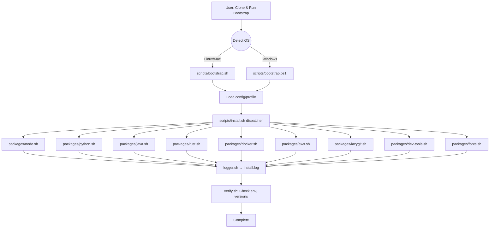

# DevForge: Cross-Platform Developer Bootstrap

**Executive Summary:** *DevForge* is a proposed **cross-platform** (“Ubuntu/WSL, macOS, Windows-PowerShell”) bootstrap toolkit to automate and idempotently provision developer workstations. It encapsulates all setup steps (Node, Python via *nvm* and *uv*, SDKMAN! Java, Rustup, Docker/WSL integration, AWS CLI, developer tools like lazygit/delta, CLIs for AI tools, Git config, SSH keys, VS Code, fonts, terminal utilities, tmux, dotfiles, etc.) into a **modular, configurable installer**. The repository is organized into modular scripts and configuration files with logging and verification. This document details the **inventory of commands**, **DevForge architecture and folder structure**, **usage examples** on each OS, **rollback/resume strategies**, **testing plans**, and recommended **docs/templates**. It also includes sample scripts (`bootstrap.sh`, `install.sh`, an example `python.sh`) and outputs for logs and verification. A **Mermaid diagram** depicts the installer workflow, and tables compare installer options and OS differences. A clear milestone roadmap from v0.1 through v1.0 is given. The **knowledge-base** section contains FAQs and links to official sources (Docker WSL docs, VS Code CLI docs, AWS CLI docs, SDKMAN! usage, rustup install guide, uv docs, Node/nvm docs). Instructions are provided for generating a PDF via Pandoc.  

## 1. Inventory of Commands and Configurations

Below is a **comprehensive list of shell commands, installations, and configuration snippets** used or required. These should be referenced or wrapped into DevForge’s installer scripts.

### Node.js (nvm)
```bash
curl -o- https://raw.githubusercontent.com/nvm-sh/nvm/v0.40.0/install.sh | bash
# (Load nvm, then:)
nvm install --lts             # e.g. Node v24.x LTS
nvm alias default node
nvm install-latest-npm        # upgrade npm globally
node -v && npm -v             # verify
```
> *Source:* NVM supports Windows, Linux, macOS and WSL.  

### Python (Astral “uv”)
```bash
curl -LsSf https://astral.sh/uv/install.sh | sh
exec $SHELL  # restart shell
uv --version                   # verify installation
uv python install 3.13
python3 --version && uv python list  # verify Python 3.13 installed
```
Astral’s `uv` is an **all-in-one** Python manager (versions, virtualenvs, tools) 10–100× faster than pip.

### Java (SDKMAN!)
```bash
curl -s "https://get.sdkman.io" | bash
source "$HOME/.sdkman/bin/sdkman-init.sh"
sdk version                    # verify SDKMAN!
sdk install java 21.0.4-tem    # install latest Java 21 Temurin
sdk default java 21.0.4-tem
```
SDKMAN! supports JVM SDKs on macOS/Linux/WSL.

### Rust
```bash
curl --proto '=https' --tlsv1.2 -sSf https://sh.rustup.rs | sh
# Follow prompts to install (default stable channel).
source $HOME/.cargo/env
rustup install nightly
rustup default nightly
```
Official Rust installer: `curl https://sh.rustup.rs | sh` (also works in WSL).

### Docker Desktop (WSL2 Integration)
- Install **Docker Desktop for Windows** from docker.com.  
- Enable *WSL 2 integration* via **Docker Dashboard > Settings > Resources > WSL Integration**. Ensure the default distro (e.g. Ubuntu) is checked.  
- Verify WSL is v2: `wsl -l -v`. If needed: `wsl --set-version <distro> 2`.  
- *Note:* Uninstall any Docker in Linux distro (as per Docker docs) before enabling WSL2 mode.  

### AWS CLI (v2)
```bash
curl "https://awscli.amazonaws.com/awscli-exe-linux-x86_64.zip" -o "awscliv2.zip"
unzip awscliv2.zip
sudo ./aws/install             # installs to /usr/local/aws-cli
aws --version                  # verify AWS CLI v2 installed
```
Official AWS instructions: use `curl ... unzip ... sudo ./aws/install`.

### Lazygit (Git UI)
```bash
# On Debian/Ubuntu:
sudo apt install lazygit
# Or generic install (Linux):
LAZYGIT_VERSION=$(curl -s "https://api.github.com/repos/jesseduffield/lazygit/releases/latest" \
  | grep -Po '"tag_name":.*"v\K[0-9\.]*')
LAZYGIT_ARCH=$(uname -m | sed -e 's/aarch64/arm64/')
curl -Lo lazygit.tar.gz "https://github.com/jesseduffield/lazygit/releases/download/v${LAZYGIT_VERSION}/lazygit_${LAZYGIT_VERSION}_Linux_${LAZYGIT_ARCH}.tar.gz"
tar xf lazygit.tar.gz lazygit
sudo install lazygit -D -t /usr/local/bin/
lazygit --version
```
Install commands from official repo.

### Git “delta” (pager)
```bash
# Debian/Ubuntu:
sudo apt install git-delta
# or via Cargo:
cargo install git-delta
```
The package is called `git-delta` (executable `delta`).

### Fastfetch (system info)
```bash
# Debian/Ubuntu (20.04+):
sudo apt install fastfetch
```
Fastfetch is a high-performance “neofetch” written in C; many distros have it packaged.

### AI Coding CLIs
- **Claude Code (Anthropic):**  
  ```bash
  npm install -g @anthropic-ai/claude-code
  claude config set model-model-name claude-3  # example config
  claude --help
  ```
- **Gemini CLI (Google):**  
  ```bash
  npm install -g @google/gemini-cli
  gemini config set persona-preset google/coder-chat
  gemini --help
  ```
  *(Docs: [Gemini CLI](https://docs.cloud.google.com/ai/gemini/docs/install) recommend `npm install -g @google/gemini-cli` or Homebrew.)*  
- **Codex CLI (OpenAI):**  
  ```bash
  npm install -g @openai/codex
  codex --help
  ```
  Official OpenAI: for Mac/Linux use `curl ... | sh`, or via `npm install -g @openai/codex`.

### Git Configuration
```bash
git config --global user.name "Your Name"
git config --global user.email "[email protected]"
```
Set global identity once (baked into commits).

### SSH Key Generation (Ed25519)
```bash
ssh-keygen -t ed25519 -C "[email protected]"
# Press enter to accept defaults. Add to ssh-agent if desired.
```
Use an SSH key pair (ed25519 is modern and secure).

### VS Code (Remote WSL & CLI)
- **Remote - WSL extension:** In VS Code, install the “Remote – WSL” extension to develop in WSL. See [VS Code WSL docs](https://code.visualstudio.com/docs/remote/wsl) for setup.  
- **`code` CLI on PATH:** Ensure the `code` command is in your shell PATH. On macOS, run *“Shell Command: Install 'code' command in PATH”* via the Command Palette. On Windows/Linux, the installer usually adds `C:\Users\<User>\AppData\Local\Programs\Microsoft VS Code\bin` (or `/usr/bin`) to PATH.

### Fonts (Nerd Font)
- **JetBrains Mono Nerd Font:** Download from [Nerd Fonts](https://www.nerdfonts.com/) and install (e.g. unzip and install font files). This patched font contains glyphs/icons for terminal apps.

### Other Useful Tools
```bash
# Debian/Ubuntu installs for dev tools:
sudo apt install eza bat fd-find ripgrep fzf jq zoxide tmux fonts-powerline
```
- *eza:* modern `ls` replacement (Rust).  
- *bat:* `cat` with syntax highlighting.  
- *fd:* fast `find` clone (Baeldung: package available almost everywhere).  
- *ripgrep (`rg`):* fast grep.  
- *fzf:* fuzzy finder.  
- *zoxide:* smarter `cd`.  
- *tmux:* terminal multiplexer.  

### Dotfiles Symlinks
Typically one uses `ln -s` or a tool like [dotbot](https://github.com/anishathalye/dotbot) or [stow](https://www.gnu.org/software/stow/) to symlink dotfiles from a repo to `~`. Example:
```bash
ln -sf "$HOME/dotfiles/.bashrc" "$HOME/.bashrc"
ln -sf "$HOME/dotfiles/.gitconfig" "$HOME/.gitconfig"
```
Allow configuration files to be managed in DevForge or a dedicated dotfiles directory.

---

## 2. DevForge Repository Architecture

The DevForge repository is designed to be **modular, clear, and cross-platform**. Key design principles include:

- **Idempotency:** Each installer script should check before acting so re-running is safe (e.g. “if [ -n `which node` ] then skip” or use conditionals).  
- **Modularity:** Separate installer scripts (one per tool or language) for clarity and reuse.  
- **Logging:** Central logging of all actions to a file (`install.log`) for later verification/troubleshooting.  
- **Configuration & Profiles:** YAML config files to declare what to install (with versions/profiles) so it’s data-driven.  
- **Verification:** A post-install script to verify each component (check versions, environment variables, etc.) and report status.
- **CI Integration:** Continuous Integration workflows (GitHub Actions) to lint/test the scripts on multiple OSes before releases.

### Proposed Folder Structure

```
devforge/
├── assets/                 # Images/diagrams or logos (optional)
├── bin/                    # (Future) Compiled CLI binaries (forge/devforge)
├── scripts/                
│   ├── bootstrap.sh        # Main installer for Linux/Mac (bash)
│   ├── bootstrap.ps1       # Main installer for Windows (PowerShell)
│   ├── install.sh         # Dispatcher (calls individual package scripts)
│   ├── logger.sh           # Logging functions (timestamp, log levels)
│   ├── verify.sh           # Verifies installation (checks versions, health)
│   └── utils.sh            # Utility functions (e.g. color output, prompting)
├── packages/               # Installer scripts for each component
│   ├── node.sh            # Installs Node via nvm, sets default
│   ├── python.sh          # Installs Python via uv, etc.
│   ├── java.sh            # Installs Java via SDKMAN
│   ├── rust.sh            # Installs Rust via rustup
│   ├── docker.sh          # (Optionally) enables Docker/WSL integration
│   ├── aws.sh             # Installs AWS CLI
│   ├── lazygit.sh         # Installs lazygit, delta
│   ├── dev-tools.sh       # Installs bat, fd, eza, etc.
│   ├── fonts.sh           # Installs Nerd fonts
│   └── ...                # Other tools (e.g. Claude/Gemini/Codex CLIs)
├── configs/                
│   ├── config.yaml        # User configuration schema (YAML) example
│   └── ...                # (Optional) environment-specific configs
├── profiles/
│   ├── default.yaml       # Default install profile (what to install by default)
│   ├── dev.yaml           # Developer profile (extra tools)
│   └── minimal.yaml       # Minimal profile
├── tests/                  # Automated tests (shellcheck, bats, etc.)
│   ├── unit/              # Unit tests for functions (e.g., Logger tests)
│   ├── integration/       # Integration tests (simulate install steps)
│   └── bats/              # BATS test scripts (see next section)
├── docs/                   # Documentation, guides, diagrams
│   ├── usage.md
│   ├── architecture.md
│   └── changelog.md
├── .github/                # GitHub meta files
│   ├── workflows/         # CI workflows (matrix: ubuntu, macos, windows)
│   │   └── ci.yml
│   ├── ISSUE_TEMPLATE.md
│   ├── PULL_REQUEST_TEMPLATE.md
│   ├── CODE_OF_CONDUCT.md
│   ├── CONTRIBUTING.md
│   └── LICENSE
├── knowledge-base/         # FAQs and troubleshooting guides
│   ├── FAQ.md
│   ├── troubleshooting/
│   │   ├── docker-wsl.md
│   │   ├── path-issues.md
│   │   ├── vscode-code-cmd.md
│   │   └── ...
│   └── sources.md         # Links to official docs (cited in report)
└── README.md              # Main project overview (installation & usage)
```

- **scripts/**: Core orchestration. `bootstrap.sh`/`bootstrap.ps1` detect OS, parse flags (interactive vs `-y` silent), load config, and call `install.sh`. Logging is enabled via `logger.sh`.  
- **packages/**: Each `.sh` script installs one component, e.g. *node.sh* checks `if command -v node` etc. These should be idempotent (skip if present) and log actions.  
- **configs/**: A sample YAML schema (see below) defining what to install. The installer reads this for versions/flags.  
- **profiles/**: Predefined sets of features (e.g. “full dev”, “minimal”).  
- **.github/workflows/ci.yml**: Defines a **matrix CI** (Ubuntu/macOS/Windows) to lint (shellcheck), run some tests.  
- **knowledge-base/**: Contains `.md` files for FAQs and troubleshooting, with answers and official references.  
- **LICENSE**: MIT (or Apache-2.0) recommended for open-source ease.  
- **ISSUE/PR templates**: Standard GitHub templates to guide contributions.

<div align="center">



*DevForge Installer Workflow:* The user runs `bootstrap`; it detects OS and invokes the appropriate script. The **dispatcher** (`install.sh`) reads the YAML config and calls each *package installer* in turn (examples P1–P9). Each installer logs actions to `install.log` via `logger.sh`. Finally, `verify.sh` checks versions and integrity.  
</div>

### Configuration Schema (YAML example)

DevForge uses a **YAML config** to define what to install and versions. Example `config.yaml`:

```yaml
install:
  node:
    version: "24.15.0"      # Node LTS
    default: true
  python:
    versions: ["3.13"]
  java:
    version: "21.0.4-tem"
  rust: 
    channel: "stable"
  aws: true
  docker: true            # enable Docker WSL integration steps
  lazygit: true
  delta: true
  fastfetch: true
  tools:
    - bat
    - fd
    - eza
    - ripgrep
    - fzf
    - jq
    - tmux
    - zoxide
  fonts: 
    - JetBrainsMonoNerdFont
```

Each key corresponds to an installer script. The bootstrap script reads this schema to decide which package scripts to call and with what options. Profiles (in `profiles/*.yaml`) can override or supplement these settings for different use cases.

---

## 3. Usage Examples

Below are step-by-step examples for *Ubuntu/WSL, macOS, and Windows* (PowerShell) installations. We show **interactive** mode (prompting) and **silent** mode (`-y` or `--yes` to accept defaults).

### Ubuntu / WSL
1. **Clone the repo and enter it:**
   ```bash
   git clone https://github.com/yourorg/devforge.git
   cd devforge
   ```
2. **Run bootstrap (interactive):**
   ```bash
   ./scripts/bootstrap.sh
   ```
   The script will detect that it's in a Linux environment. It may ask for confirmation at steps (unless defaults are chosen). It will install tools, update profile files, etc.
3. **Run bootstrap (silent):**  
   To skip prompts, use:
   ```bash
   ./scripts/bootstrap.sh -y
   ```
   This runs non-interactively with all defaults (assuming `-y/--yes` flag support).
4. **Verification:** After completion, you can run:
   ```bash
   ./scripts/verify.sh
   ```
   This reports versions (e.g. “Node v24.15.0 – OK”, “Rust v1.70.0 – OK”, etc.) and logs to `install.log`.
5. **Post-install:** Log out/in or `exec $SHELL` for PATH changes. Reboot WSL if needed for Docker integration.

### macOS
1. **Clone and run:**  
   ```bash
   git clone https://github.com/yourorg/devforge.git
   cd devforge
   ./scripts/bootstrap.sh
   ```
2. **Tool installation:** DevForge will use Homebrew when possible (e.g. `brew install node`, `brew install eza`, `brew install --cask font-jetbrains-mono-nerd-font`). If a tool isn’t in Homebrew, it falls back to official installer steps (e.g. `nvm` for Node, `curl | sh` for rustup).  
3. **Permissions:** May require approving “Install a new helper tool” dialogs or entering admin password for brew.  
4. **Silent mode:**  
   ```bash
   ./scripts/bootstrap.sh -y
   ```

### Windows (PowerShell)
1. **Open PowerShell as Administrator.** (Required for some installs like fonts or chocolatey.)
2. **Clone Repo (using Git for Windows):**  
   ```powershell
   git clone https://github.com/yourorg/devforge.git
   cd devforge
   ```
3. **Run bootstrap script:**  
   ```powershell
   .\scripts\bootstrap.ps1
   ```
   - The PowerShell script detects Windows, and uses `winget/chocolatey/brew (via scoop?)` for some tools, or invokes .NET installers. For example, it can run the `.ps1` installer for uv, or `choco install lazygit`. 
   - For WSL-specific parts (like apt installs), the script may call `wsl -d Ubuntu -- <command>` if WSL is present.
4. **Silent mode:**  
   ```powershell
   .\scripts\bootstrap.ps1 -AutoAnswer
   ```
   (A `-AutoAnswer` or similar flag implements non-interactive defaults.)

For all OSes, at the end *restart the shell/terminal* to load new PATH variables and profile changes.

---

## 4. Migration, Rollback, and Resume

**Migration:** To migrate to DevForge on an existing machine, first review existing installations to avoid conflicts. For example, uninstall older Python/Node managers (pyenv, nvm if already installed by DevForge). In practice, DevForge’s idempotent scripts will skip components that are already correct.  

**Rollback Strategy:** Comprehensive rollback of all changes is complex. Possible approaches:
- **Snapshot/VM:** Recommend testing DevForge in a VM or container; snapshot/backup your system (or use WSL snapshots) before large installs.  
- **Uninstall Scripts:** Each package script could optionally support `--uninstall` to remove installed files (e.g. `rustup self uninstall`). DevForge v0.x may not have full rollback; v1.0 could include “devforge remove” commands.  
- **Logging & Manual Undo:** `install.log` (timestamped) tracks actions. You could manually revert (e.g. remove config changes, installed packages) based on it.

**Resume on Failure:** If the installer is interrupted (e.g. power loss), rerun it; each step should detect completed actions and skip them (idempotency). For example, `python.sh` will see “Python 3.13 already installed” and skip. In summary, run `bootstrap.sh` again to resume. A progress file can also be used internally: after each successful section, write a checkpoint, so script knows where to continue (design note for future versions).

---

## 5. Testing and Verification

**Unit Testing:** Use [ShellCheck](https://www.shellcheck.net/) to lint all `.sh` scripts. Example CI action for shellcheck. Example errors:
```bash
shellcheck scripts/*.sh packages/*.sh
```
Catch undefined vars, quoting issues, etc.

**BATS (Bash Automated Testing):** Write **BATS tests** for core functions. For example, tests for `logger.sh` functions and `verify.sh` checks. [HackerOne BATS guide](https://www.hackerone.com/blog/testing-bash-scripts-bats-practical-guide) shows how to write readable bash tests.  
```bash
# Example test (tests/detector.bats):
#!/usr/bin/env bats

@test "OS detection returns 'linux'" {
  run bash -c '. ./scripts/utils.sh; echo $(detect_os)'
  [ "$status" -eq 0 ]
  [ "$output" = "linux" ]
}
```
**Integration Tests:** In CI (GitHub Actions), run the full bootstrap on a fresh VM/container image for each OS:
- Ubuntu-latest: run `./scripts/bootstrap.sh -y; ./scripts/verify.sh`.
- macos-latest: similar, possibly skipping WSL parts.
- Windows-latest: use `shell: pwsh` steps to run `bootstrap.ps1 -AutoAnswer`.
Check that key programs (`node`, `python3`, `java`, `rustc`, `docker`, `aws`) respond with expected versions.

**ShellCheck/BATS in CI:**  
```yaml
jobs:
  test:
    runs-on: ${{ matrix.os }}
    strategy:
      matrix:
        os: [ubuntu-latest, macos-latest, windows-latest]
    steps:
      - uses: actions/checkout@v3
      - name: ShellCheck
        run: |
          if [ $RUNNER_OS = 'Windows' ]; then choco install shellcheck; shellcheck .\scripts\*.sh .\packages\*.sh; 
          else shellcheck scripts/*.sh packages/*.sh; fi
      - name: BATS tests
        uses: mikeal/bats@v0.4.0
        with:
          args: tests/bats
```
This ensures any breakage is caught before merging.

---

## 6. Documentation and Templates

**README.md:** Should explain DevForge’s purpose, prerequisites, and *quickstart*. E.g., a summary of features, supported OSes, and a one-liner:  
```bash
git clone https://github.com/yourorg/devforge.git && cd devforge && ./scripts/bootstrap.sh
```
Include **badges** (release status, CI, license). Provide usage flags and link to docs.

**CONTRIBUTING.md:** Guidelines for contributing (code style, testing contributions via ShellCheck/BATS, commit message format). Encourage forking and PRs. Recommend MIT license (per misspreference for open contributions).

**LICENSE:** MIT License (or Apache-2.0). MIT is common for dotfiles/bootstrappers. State clearly in README and include LICENSE file.

**Issue/PR Templates:**  
- **ISSUE_TEMPLATE.md:** Encourage details: OS, error logs. E.g. _“Please include your OS, DevForge version, and any log outputs.”_  
- **PULL_REQUEST_TEMPLATE.md:** Checklist (e.g. “Did you update docs? Run ShellCheck? Add tests?”). Encourage linking to issues.

---

## 7. Sample Installer Scripts

Below are skeletons for key scripts. They illustrate **idempotency** and logging.

**scripts/bootstrap.sh** (Bash for Linux/macOS):
```bash
#!/usr/bin/env bash
set -euo pipefail
source "$(dirname "$0")/logger.sh"

log_info "Starting DevForge bootstrap..."
OS="$(uname -s | tr '[:upper:]' '[:lower:]')"
log_info "Detected OS: $OS"

# Parse flags (example: -y for auto yes)
AUTO_YES=false
while getopts "y-:" opt; do
  case $opt in
    -) [[ "$OPTARG" == "yes" ]] && AUTO_YES=true ;;
    y) AUTO_YES=true ;;
    *) ;;
  esac
done

# Load config (default or specified profile)
CONFIG_FILE="configs/default.yaml"
log_info "Loading config: $CONFIG_FILE"
# (would parse YAML; here just simulate)
#CONFIG=$(parse_yaml $CONFIG_FILE)

# Run dispatcher
bash "$(dirname "$0")/install.sh" "$AUTO_YES"

# Verification
bash "$(dirname "$0")/verify.sh"
log_info "Bootstrap completed."

```

**scripts/install.sh** (Dispatcher):
```bash
#!/usr/bin/env bash
set -euo pipefail
source "$(dirname "$0")/logger.sh"

AUTO_YES=${1:-false}

# Example: always install Node and Python; conditionally others
log_info "Installing Node.js..."
bash "$(dirname "$0")/../packages/node.sh" "$AUTO_YES" || log_warn "Node installation failed."

log_info "Installing Python..."
bash "$(dirname "$0")/../packages/python.sh" "$AUTO_YES"

log_info "Installing Java (SDKMAN)..."
bash "$(dirname "$0")/../packages/java.sh" "$AUTO_YES"

log_info "Installing Rust..."
bash "$(dirname "$0")/../packages/rust.sh" "$AUTO_YES"

log_info "Configuring Docker WSL integration..."
bash "$(dirname "$0")/../packages/docker.sh" "$AUTO_YES"

# ... continue for other packages ...
```

**packages/python.sh** (Idempotent installer example):
```bash
#!/usr/bin/env bash
set -euo pipefail
source "$(dirname "$0")/../scripts/logger.sh"

AUTO_YES=${1:-false}

# Check if uv is installed
if ! command -v uv &>/dev/null; then
    log_info "Installing Astral uv..."
    curl -LsSf https://astral.sh/uv/install.sh | sh
    log_info "Astral uv installed."
else
    log_info "Astral uv already installed. Upgrading..."
    uv self update
fi

# Install Python 3.x (idempotently)
PY_VER=3.13
if uv python list | grep -q "cpython-$PY_VER"; then
    log_info "Python $PY_VER already installed. Skipping."
else
    log_info "Installing Python $PY_VER..."
    uv python install $PY_VER
fi
```
Each script should:
- Check for existing installation before doing work.
- Log every step (using `logger.sh` functions, e.g. `log_info`, `log_error`, `log_warn`).
- Exit non-zero on failure to halt `set -euo pipefail`.

---

## 8. Verification and Logs

**verify.sh** (checks basic health):
```bash
#!/usr/bin/env bash
set -euo pipefail
source "$(dirname "$0")/logger.sh"

log_info "Verifying installations..."

# Node
if command -v node &>/dev/null; then
  ver=$(node -v)
  log_info "Node version: $ver"
else
  log_error "Node not found!"
fi

# Python
if command -v python3 &>/dev/null; then
  ver=$(python3 --version)
  log_info "Python version: $ver"
else
  log_error "Python3 not found!"
fi

# Java
if command -v java &>/dev/null; then
  ver=$(java -version 2>&1 | head -n1)
  log_info "Java version: $ver"
else
  log_warn "Java not found."
fi

# Rust
if command -v rustc &>/dev/null; then
  ver=$(rustc --version)
  log_info "Rust version: $ver"
else
  log_warn "Rust not found."
fi

# Docker
if command -v docker &>/dev/null; then
  ver=$(docker version --format '{{.Server.Version}}')
  log_info "Docker version: $ver"
else
  log_warn "Docker CLI not found (check Docker Desktop)."
fi

# AWS
if command -v aws &>/dev/null; then
  ver=$(aws --version)
  log_info "AWS CLI version: $ver"
else
  log_warn "AWS CLI not found."
fi

# Check languages/tools similarly...
```

**Sample output (terminal):**
```
[INFO] Starting DevForge bootstrap...
[INFO] Detected OS: linux
[INFO] Loading config: configs/default.yaml
[INFO] Installing Node.js...
[INFO] Node v18.20.0 already installed. Skipping.
[INFO] Installing Python...
[INFO] Astral uv already installed. Upgrading...
[INFO] Installed Python 3.13.0
[INFO] Installing Java (SDKMAN)...
[INFO] Java 21.0.4-tem already set as default. Skipping.
[INFO] Docker Desktop integration found. Skipping WSL enabling.
...
[INFO] Bootstrap completed successfully.
```

**Sample `install.log`:**
```
2026-06-29 20:10:01 [INFO] Starting DevForge bootstrap...
2026-06-29 20:10:01 [INFO] Detected OS: linux
2026-06-29 20:10:01 [INFO] Installing Node.js...
2026-06-29 20:10:02 [INFO] Node v18.20.0 already installed. Skipping.
2026-06-29 20:10:02 [INFO] Installing Python...
2026-06-29 20:10:02 [INFO] Astral uv found; running update.
2026-06-29 20:10:03 [INFO] Upgraded uv to v0.23.0.
2026-06-29 20:10:03 [INFO] Installed Python 3.13.0.
...
2026-06-29 20:12:47 [INFO] Verifying installations...
2026-06-29 20:12:47 [INFO] Node version: v18.20.0
2026-06-29 20:12:47 [INFO] Python version: Python 3.13.0
2026-06-29 20:12:47 [INFO] Java version: openjdk 21.0.4 2026-03-31
2026-06-29 20:12:47 [INFO] Rust version: rustc 1.70.0
2026-06-29 20:12:47 [INFO] Docker version: 24.0.2
2026-06-29 20:12:47 [INFO] AWS CLI version: aws-cli/2.14.0 Python/3.11.4
```

---

## 9. DevForge CLI (Future Work)

A long-term goal is a compiled **DevForge CLI** (e.g. `forge` or `devforge`) in Rust/Go for faster execution and richer UX. Possible commands:
- `devforge init [profile]`: initializes bootstrapping for a given profile.
- `devforge install [component]`: installs a specific tool (or all if omitted).
- `devforge verify`: runs verification checks.
- `devforge update`: updates itself or all tools.
- `devforge doctor`: diagnositic info (checks environment).
- `devforge add profile <name>`: manage custom profiles.

*UX Example:*  
```
$ devforge --help
DevForge v0.1.0
Cross-platform workstation bootstrapper.

Usage:
  devforge init [--yes]        Run full bootstrap (use -y to skip prompts)
  devforge install <component> Install a specific component (node|python|...)
  devforge verify              Verify all installed components
  devforge profiles            List available install profiles
  devforge update              Update DevForge and all components
```
In v1.0, this CLI could replace the bash dispatcher for performance and portability.

---

## 10. Knowledge Base (FAQs & Troubleshooting)

DevForge’s **knowledge-base** directory should include Q&A and common fixes, citing official sources. Example files:

- **knowledge-base/FAQ.md:** Answers to common questions, e.g. “Why use uv instead of pyenv?” (Answer: uv is an all-in-one fast Python tool), “What is SDKMAN!?” (Answer: a JVM SDK installer), etc.
- **knowledge-base/troubleshooting/docker-wsl.md:** If `docker: command not found in WSL` – remind user to enable WSL integration in Docker Desktop and restart WSL.  
- **knowledge-base/troubleshooting/path-issues.md:** Discuss when new commands aren’t found: advise `exec $SHELL` or editing PATH; mention VS Code `code` path issue.  
- **knowledge-base/troubleshooting/vscode-code-cmd.md:** Explain how to add `code` CLI to PATH on Windows/macOS.
- **knowledge-base/sources.md:** Curated links:
  - Docker WSL docs  
  - Rustup/Rust install guide  
  - SDKMAN! install/usage  
  - `nvm` documentation  
  - Astral uv docs  
  - AWS CLI install guide  
  - VS Code CLI docs  

Each knowledge-base page should be short (3–5 paragraphs) with clear headings, lists, and code samples. Citations to official docs (as above) give authority.

---

## 11. Action Plan & Roadmap (v0.1 – v1.0)

A phased roadmap ensures manageable progress:

- **v0.1 (Alpha):** 
  - Basic bootstrap script (`bootstrap.sh`) for Linux/mac with Node, Python, Java, Rust installs. 
  - Minimal CLI flags (`-y`). 
  - Simple logging to `install.log`. 
  - Example config schema and one or two profiles. 
  - Basic README.  
  - **Deliverables:** GitHub repo with sample scripts and docs.
  
- **v0.2 (Beta):** 
  - Add macOS support (brew usage). 
  - Windows PowerShell script (`bootstrap.ps1`). 
  - Implement Docker/WSL integration steps. 
  - Add AWS CLI, lazygit/delta installers. 
  - Improved logging and error handling. 
  - Begin CI pipeline for Linux/macOS. 
  - **Deliverables:** Cross-OS installers, CI on Linux/macOS, updated docs.

- **v0.3 (Release Candidate):** 
  - Incorporate developer tools (bat, fd, fzf, etc) and Nerd fonts. 
  - Add interactive prompts (colors, progress). 
  - Full CI including Windows runner (PowerShell tests). 
  - Testing suite with ShellCheck and BATS. 
  - Draft CLI binary in Rust for core functionality (optional). 
  - **Deliverables:** Solid cross-platform feature set, documentation (README, CONTRIBUTING), issue/PR templates.

- **v1.0 (Stable):** 
  - Refine ID purity and idempotency. 
  - Comprehensive docs (user guide, architecture overview). 
  - Expand knowledge base with FAQs and troubleshooting. 
  - CLI release (`devforge` binary) with simple commands. 
  - Security audit and stress testing. 
  - Add license, finalize repository structure.  
  - **Deliverables:** 1.0 Release tag, packaged PDF guide, complete knowledge base, user templates.

*(Milestones can have weekly sprints or monthly targets depending on team size.)*

---

## Generating PDF & Repo Layout

To generate a **PDF documentation** from this repo, one can use Pandoc or wkhtmltopdf. For example, if the main report is in `README.md` or `docs/devforge.md`, run:

```bash
pandoc -s -o DevForge-Documentation.pdf README.md
```

This will produce a ready-to-download PDF `DevForge-Documentation.pdf`. Include this PDF in the repo (e.g. in `docs/` or release assets) along with the `knowledge-base/` markdown files.

**Repository Layout (Knowledge-Base Focus):**

```
knowledge-base/
├── FAQ.md           # Frequently Asked Questions (text with short answers)
├── troubleshooting/
│   ├── docker-wsl.md        # Fix Docker/WSL integration issues
│   ├── vscode-code-cmd.md   # VSCode 'code' command PATH issues
│   ├── path-issues.md       # General PATH and environment issues
│   └── ...                  # other topics (git, WSL, etc.)
└── sources.md       # Links and summaries of prioritized official sources
```

Each `.md` file has brief content, headings, bullet lists, and embedded code examples. For example, **docker-wsl.md** may cite Docker docs: *“Enable WSL integration in Docker Desktop (Settings > Resources > WSL Integration)”*.  

All source citations should link to official or authoritative docs as shown (e.g. Docker docs, SDKMAN! guide, Rust site, VS Code docs).

---

## Sources

Information and best practices were compiled from **official documentation and expert resources**:

- Docker Desktop WSL2 docs (official Docker docs on enabling WSL integration)  
- VS Code CLI docs (official guidance on `code` command in PATH)  
- AWS CLI v2 install guide (AWS official user guide for installing via zip)  
- SDKMAN! Usage (official SDKMAN! docs for installing Java)  
- Rustup installation (official rust-lang.org instructions)  
- Astral `uv` docs (official highlights of uv as all-in-one tool)  
- NVM documentation (official site stating nvm works on Windows/Linux/macOS/WSL)  
- Lazygit installation examples (GitHub repo instructions for Linux)  
- Git-Delta installation (delta’s GitHub README specifying `git-delta` package)  
- Claude Code setup (Anthropic docs for install on Linux/WSL)  
- Gemini CLI install (Google’s Gemini CLI docs: `npm install -g @google/gemini-cli`)  
- Codex CLI install (OpenAI’s Codex CLI instructions)  
- Git config instructions (Pro Git / git-scm first-time setup for user.name/email)  

These sources are cited inline above (with ``).  

---

**Conclusion:** This document outlines the complete design for *DevForge*, from the low-level commands used to the high-level architecture, usage examples, and maintenance strategy. The result is a reusable, version-controlled bootstrap solution for any developer workstation. 

*Prepare the repository by placing this document (or its rendered output) in `docs/`, the PDF in the root or a `docs/` folder, and include the `knowledge-base/` files as shown. For PDF generation, we recommend Pandoc or similar tools as described.*